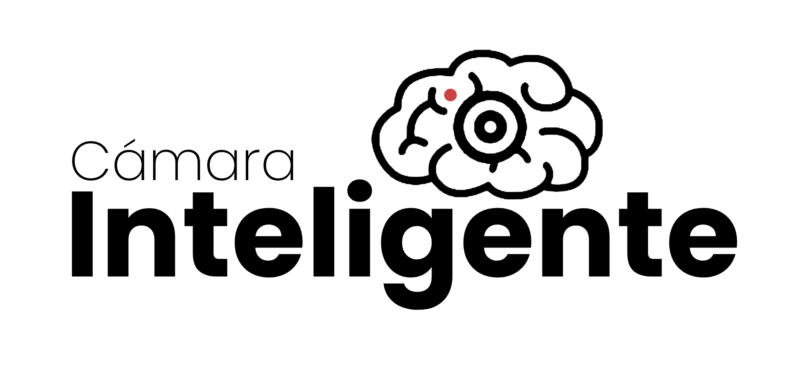

<p align="center">
    
</p>

# 🛠️ | pre-requisites

1. Python 3.9-3.12

1. Create a `credentials.yml` file based on the `credentials.example.yml` file

1. Create the virtual env 
    ```bash
        python -m venv venv
    ```

1. Open the virtual env
    ```bash
        # In cmd.exe
        venv\Scripts\activate.bat
        # In PowerShell
        venv\Scripts\Activate.ps1
    ```

1. Install PyTorch depending on your machine components
    ```bash
        # Follow the instructions at https://pytorch.org/get-started/locally/
        # i.e.
        pip3 install torch torchvision torchaudio --index-url https://download.pytorch.org/whl/cu118
    ```

1. Install all packages
    ```bash
        pip install -r requirements.txt
    ```

# 📦 | After install a new `pip` librarie

```bash
    pip freeze > requirements.txt
```

# 👥 | Members

- José Leiva [@JoseIgnacioGC](https://github.com/JoseIgnacioGC)<br>
- Martín León [@Martin19832](https://github.com/Martin19832)<br>
- Benjamín Isasmendi [@Mapacheee](https://github.com/Mapacheee)

# ⚰️ | Old Project

- [@Mapacheee/IntelligentCamera](https://github.com/Mapacheee/IntelligentCamera)
